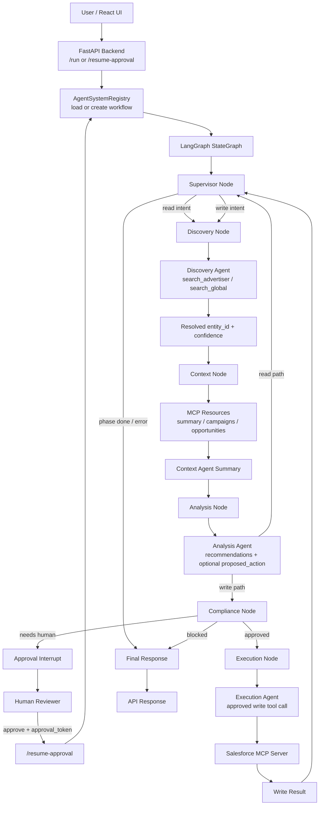
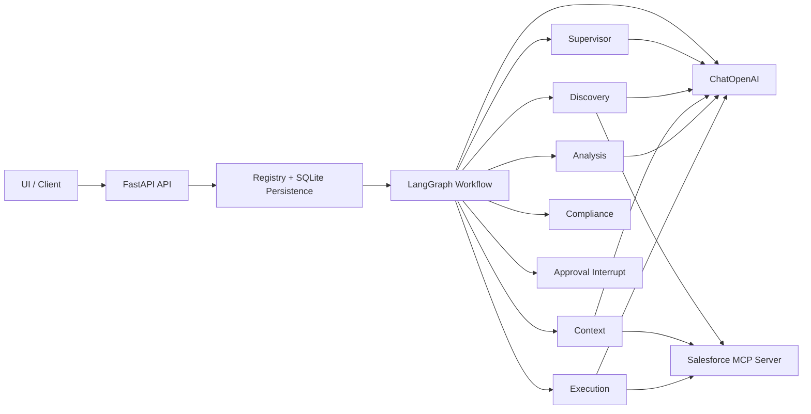

# Agent Flow

This document captures the implemented workflow in [`C:\Users\tiger\project\salesforce-agent`](C:\Users\tiger\project\salesforce-agent).

## End-to-End Flow

## Component View

## Implemented Node Order

1. `supervisor`
2. `discovery`
3. `context`
4. `analysis`
5. `compliance` on write path
6. `approval` for high-risk writes
7. `execution`
8. back to `supervisor` for final response

## Routing Rules

- `supervisor`
  - `read` -> `discovery`
  - `write` -> `discovery`
  - terminal phase -> end
- `analysis`
  - error -> end
  - read intent -> `supervisor`
  - write intent -> `compliance`
- `compliance`
  - blocked -> end
  - approved -> `execution`
  - needs human -> `approval`

## Main Files

- [`C:\Users\tiger\project\salesforce-agent\agents\system.py`](C:\Users\tiger\project\salesforce-agent\agents\system.py)
- [`C:\Users\tiger\project\salesforce-agent\agents\routing.py`](C:\Users\tiger\project\salesforce-agent\agents\routing.py)
- [`C:\Users\tiger\project\salesforce-agent\agents\nodes\supervisor.py`](C:\Users\tiger\project\salesforce-agent\agents\nodes\supervisor.py)
- [`C:\Users\tiger\project\salesforce-agent\agents\nodes\discovery.py`](C:\Users\tiger\project\salesforce-agent\agents\nodes\discovery.py)
- [`C:\Users\tiger\project\salesforce-agent\agents\nodes\context_agent.py`](C:\Users\tiger\project\salesforce-agent\agents\nodes\context_agent.py)
- [`C:\Users\tiger\project\salesforce-agent\agents\nodes\analysis.py`](C:\Users\tiger\project\salesforce-agent\agents\nodes\analysis.py)
- [`C:\Users\tiger\project\salesforce-agent\agents\nodes\compliance.py`](C:\Users\tiger\project\salesforce-agent\agents\nodes\compliance.py)
- [`C:\Users\tiger\project\salesforce-agent\agents\nodes\approval.py`](C:\Users\tiger\project\salesforce-agent\agents\nodes\approval.py)
- [`C:\Users\tiger\project\salesforce-agent\agents\nodes\execution.py`](C:\Users\tiger\project\salesforce-agent\agents\nodes\execution.py)
